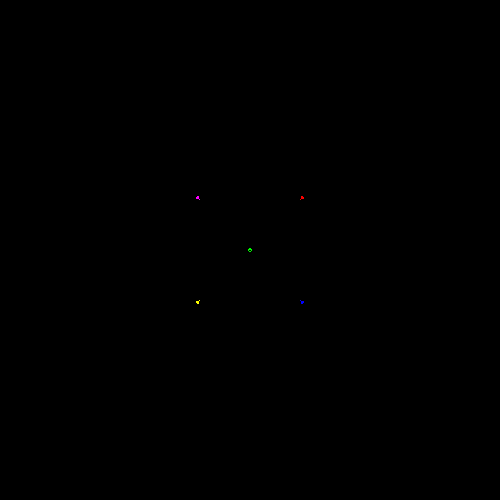

## Benjamin Newman MATH397 Portfolio

### Working files:

- [coolpattern1.eps](coolpattern1.eps)
- [coolrainbow.eps](coolrainbow.eps)
- [image.eps](image.eps)
- N Body Problem!  
-  

### 3d stuff:

- 
- 

### WIP:

- [image2.eps](image2.eps)
- orbit.eps
- simple_orbit.eps

- all of my 3d postscript will always be WIP:
  - midterm/3d/3d.eps is the main file (i.e. the library)

### Progress log:

- 2022-02-24: Created coolpattern1, started work on image/image2
- 2022-02-25: Finished image/image2
- 2022-02-26: Started work on nbodyproblem
- 2022-02-27: Finished nbodyproblem, started on orbit + epicycloid orbit
- 2022-02-28: Generalized nbodyproblem to actually be n bodies and not 3, optimized nbodyproblem a lot
- 2022-03-01: Made nbodyproblem look cooler
- 2022-03-02: More work on nbodyproblem
- 2022-03-03: Lots of optimization on nbodyproblem (10x faster)
- 2022-03-04 through 2022-03-11: Thinking of midterm ideas [notes](midterm/midterm_notes), nbodyproblem optimization, start of work on midterm
- 2022-03-12 through 2022-03-18: More work on midterm (GOL fully working, langton's ant WIP) Fully (not really) featured 3d rendering!!
